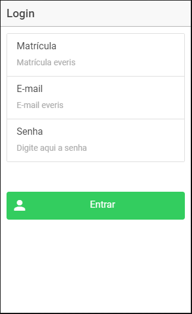
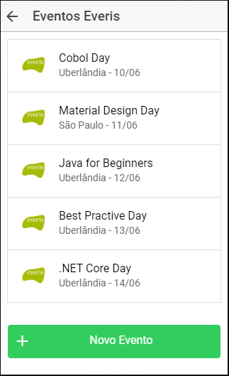
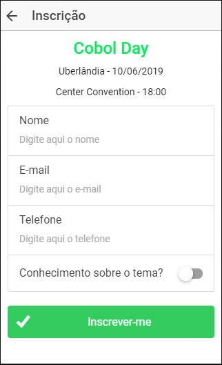
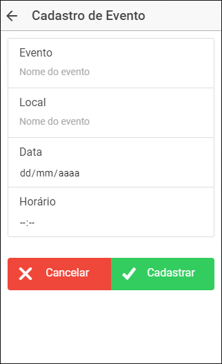

<b>Desafio</b>

A everis tem a necessidade de criar um aplicativo para gerenciar os eventos internos.
Esse aplicativo deve cadastrar eventos, os organizadores, data e local desse evento. Também é necessário que os usuários do aplicativo possam se cadastrar nos eventos de seu interesse.

<b>Telas</b>

| Telas              | Detalhamento funcionalidade                                 |
| ------------------ | ----------------------------------------------------------- |
| Login              | Autenticar o usuário everis                                 |
| Lista de Eventos   | Lista de todos os eventos                                   |
| Inscrição          | Tela com detalhamento do evento e formulário para inscrição |
| Cadastro de Evento | Tela disponível apenas para usuários com perfil admin       |

<b>Protótipos</b>

| Login                                                | Lista de Eventos                                             | Inscrição                                                | Cadastro de Evento                                         |
| ---------------------------------------------------- | ------------------------------------------------------------ | -------------------------------------------------------- | ---------------------------------------------------------- |
|  |  |  |  |

